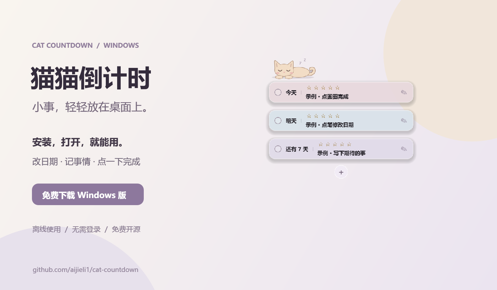
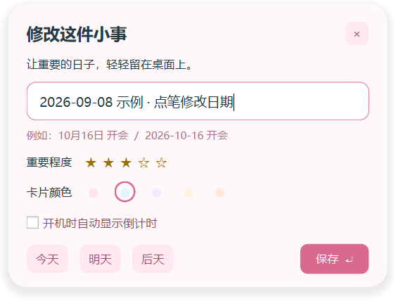

<div align="center">

# 🐾 猫猫倒计时 · Cat Countdown

**把重要的日子，轻轻放在桌面上。**

一个简单、离线、带小猫的 Windows 桌面倒计时浮窗。安装后就能用。

[](https://github.com/aijieli1/cat-countdown/releases/latest/download/CatCountdown-Setup-1.1.1-Windows-x64.exe)

[所有版本](https://github.com/aijieli1/cat-countdown/releases) · [反馈问题](https://github.com/aijieli1/cat-countdown/issues) · [English](#english)



</div>

## 下载，安装，就在桌面上

1. **[下载 Windows 安装包](https://github.com/aijieli1/cat-countdown/releases/latest/download/CatCountdown-Setup-1.1.1-Windows-x64.exe)**。
2. 双击，点 **安装**。不需要 Python、不需要注册、不需要管理员权限。
3. 猫猫和 **三条明确标注“示例”的任务** 出现在桌面上。直接改成自己的事情就好。

支持 **Windows 10（1809 或更新）/ Windows 11，Intel 或 AMD 64 位电脑**。macOS、Linux 暂不支持。

> 当前安装包尚未购买代码签名证书，Windows 可能显示“未知发布者”或 SmartScreen 提示。请确认文件来自本仓库的 Releases，并可用发布页的 SHA256 校验文件核对。安装程序不会要求关闭安全软件。

## 只做这几件小事

| 你想做什么 | 怎么操作 |
| --- | --- |
| 记下一件事 | 点 **＋**，或者按 **Ctrl + Alt + T** |
| 标记重要程度 | 点卡片上的五颗星，随时改；再点当前星级可清除。编辑窗口也能设置，排序仍按日期。 |
| 改时间、改内容 | 点卡片右侧 **✎**，或双击卡片；示例也一样可改 |
| 完成一件事 | 点左侧圆圈，轻轻淡出 |
| 换个位置 | 拖动猫猫或卡片，下次打开还在这里 |
| 找不到窗口 | **再次双击桌面图标**，会把现有窗口带回主屏 |
| 看完整内容和日期 | 鼠标停在卡片上 |
| 开机就出现 | 开始菜单 → 猫猫倒计时 → **开启开机启动** |
| 暂时收起来 / 退出 | 右键系统托盘里的猫猫图标 |

输入也很简单：

```text
今天 整理桌面
明天 交材料
后天 去看电影
10月16日 生日聚餐
2027-01-01 新年第一件小事
```

**日期后加一个空格，再写事情。** Enter 保存，Esc 取消。没有年份的日期取下次到来的那一天。

桌面只显示“今天”“明天”“还有 N 天”“已过期 N 天”。过期不会自动删除，完成由你决定。

<details>
<summary>看看编辑窗口</summary>



</details>

## 轻一点，也实用一点

- 圆角、柔色、半透明，字清楚，猫安静地趴着。
- 不登录，不同步，不联网，不收集使用数据。
- 事情按日期排列，跨天自动更新；多了可以滚动。
- 示例只在首次使用时创建，清空后不会反复冒出来。
- 数据只存在你自己的电脑。卸载保留任务，重新安装还能继续用。

如果它让你的桌面轻松了一点，欢迎点一个 **Star ⭐**，或把仓库链接分享给也喜欢简单工具的人。

## 常见问题

**窗口是不是一直盖住别的软件？**

不是强制置顶。它是无边框桌面浮窗，其他窗口可以盖住它；双击启动图标即可找回。找回窗口不会覆盖原位置记录，只有你主动拖动才保存新位置。

**快捷键没反应？**

其他软件可能已经占用了 Ctrl + Alt + T。猫猫会提示，仍然可以用桌面 ＋ 或托盘创建任务。

**数据在哪里？**

`%LOCALAPPDATA%\CountdownWidget\tasks.json`。备份这个文件即可。写入采用临时文件提交，失败会提示；损坏的数据不会被悄悄清空。

**怎样卸载？**

在 Windows 设置的应用列表里卸载“猫猫倒计时”，或从开始菜单打开卸载入口。用户任务文件会保留。

## 给想自己改一改的人

Python 3.12 + PySide6，界面和逻辑在 `main.py`，猫插画也是程序绘制的。项目代码采用 MIT 许可；随安装包分发的 Qt/PySide6 等依赖保留各自许可证，见 [第三方说明](THIRD_PARTY_NOTICES.md)。

```powershell
py -3.12 -m venv .venv
.venv\Scripts\python -m pip install -r requirements.txt
.venv\Scripts\python main.py
.venv\Scripts\python test_widget.py
```

构建安装包需要 [Inno Setup 6](https://jrsoftware.org/isinfo.php)：

```powershell
.venv\Scripts\python -m PyInstaller --noconfirm CountdownWidget.spec
ISCC.exe installer.iss
```

产物在 `installer-output/`。底层 Qt 动态库独立放在应用 `_internal` 目录，允许替换和重新构建；无需改动个人数据。CI 提供源码检查和 Windows 构建，正式发行前应实际验证安装与交互。

## English

**Cat Countdown** is a small, offline Windows desktop countdown widget with a sleeping cat. Install it, edit the three labeled examples, and keep your dates on the desktop.

- Soft translucent cards, editable dates and titles, click-to-complete.
- No account, no cloud, no telemetry. Local JSON storage.
- Drag to move; launch again to bring the existing window back to the main screen.
- Windows 10/11 x64. The current interface is in Chinese.

[Download the Windows installer](https://github.com/aijieli1/cat-countdown/releases/latest/download/CatCountdown-Setup-1.1.1-Windows-x64.exe) · [Report a bug](https://github.com/aijieli1/cat-countdown/issues)
